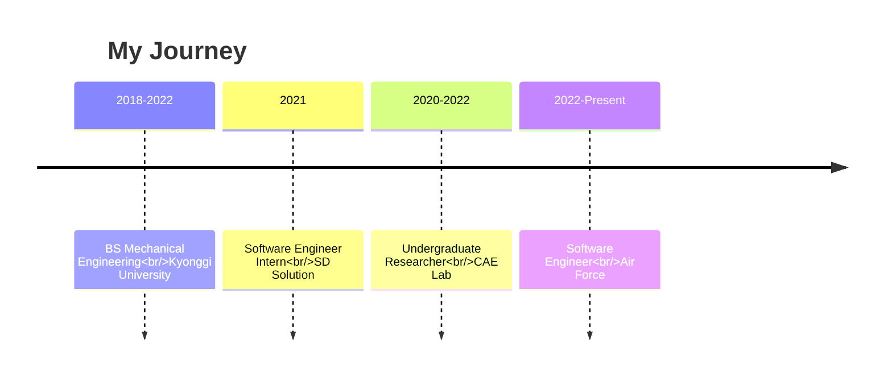

<div align="center">

# 👋 Hi, I'm Luke (Hyungjin Lee)

### Full Stack Developer | AI/ML, Robotics Enthusiast

[](https://lukedev.info)
[](https://www.linkedin.com/in/%ED%98%95%EC%A7%84-%EC%9D%B4-ab1a29247/)
[](mailto:luke93052080@gmail.com)
[](https://informluke.tistory.com/)

</div>

---

## 🚀 About Me

```typescript
const luke = {
  location: "Ansan, South Korea 🇰🇷",
  role: "Software Engineer @ Air Force",
  background: "Mechanical Engineering → Software Development",
  passion: ["AI/ML", "Robotics", "Full Stack Development"],
  currentFocus: "Building intelligent systems with modern web technologies",

  learning: {
    deepening: ["Next.js", "AWS", "Docker"],
    exploring: ["Kubernetes", "Microservices", "System Design"]
  },

  funFact: "I bridge the gap between mechanical engineering and software! 🔧💻"
};
```

I'm a **Full Stack Web Developer** with a unique background in **Mechanical Engineering** and specialized expertise in **AI/ML technologies**. Currently serving as a Software Engineer in the Air Force, I build robust applications that combine engineering principles with cutting-edge software solutions.

---

## 💼 Professional Experience



---

## 🛠️ Tech Stack

### Languages


### Frontend


### AI/ML & Data Science


### Robotics & Simulation


### Design & CAD


### DevOps & Cloud


---

## 🎯 Featured Projects

<table>
<tr>
<td width="50%">

### 🤖 [Fusion 360 URDF Generation](https://github.com/RO-AD/fusion2urdf_ros2cpp)
**Robot Simulation Tool**

- 🎤 Presented at **Autodesk Webinar**
- 🔧 Fusion 360 API integration
- 🎮 Unity & NVIDIA Omniverse compatible
- 📹 [Watch Demo](https://www.youtube.com/watch?v=n4WcBF8ReGQ)

`Fusion360` `Python` `Unity` `URDF` `ROS`

</td>
<td width="50%">

### 🛡️ Defense Robotics Competition
**Robotic Arm & Vehicle Development**

- 🏆 National Defense Robotics Competition
- 🔩 Full mechanical design in Fusion360
- 🤖 ROS & Gazebo simulation
- 👥 Founded & led club **RO:AD**

`ROS` `Gazebo` `URDF` `Python`

</td>
</tr>

<tr>
<td width="50%">

### 🧠 Robotic Arm Fault Diagnosis
**ML-Based Fault Detection**

- 🏆 **Grand Prize** - Capstone Design
- 📊 Deep Learning for diagnostics
- 🎓 Graduation Thesis Project
- 🔬 Mechanical + AI integration

`TensorFlow` `Machine Learning` `Python`

</td>
<td width="50%">

### 🚗 Unity ML Autonomous Driving
**Inter-City Self-Driving Simulation**

- 🎮 Unity ML-Agent environment
- 🚙 Autonomous vehicle simulation
- 📄 Conference paper (2nd author)
- 🏅 Advanced to finals

`Unity` `ML-Agent` `Deep Learning`

</td>
</tr>
</table>

---

## 📊 GitHub Stats

<div align="center">


</div>

<div align="center">

[](https://git.io/streak-stats)

</div>

---

## 🏆 Achievements & Certifications

```yaml
Certifications:
  - "🎓 TensorFlow Developer Certificate (2021)"
  - "💻 Engineer Information Processing (2021)"
  - "🎖️ NVIDIA DLI Certification for Basic Deep Learning (2022)"
  - "🖨️ Craftsman 3D Printer Operation (2020)"

Awards:
  - "🥇 Grand Prize - Capstone Design Competition (2021)"
  - "🏁 Acceleration Prize - University Self-Built Car Competition (2019)"
  - "🎯 Finalist - KSIT Conference Autonomous Driving (2021)"
  - "🎤 Speaker - Autodesk Webinar (2022)"
```

---

## 💡 What I'm Up To

- 🔭 Currently working on **military software solutions** at the Air Force
- 🌱 Learning **advanced AWS architecture** and **Kubernetes**
- 👯 Looking to collaborate on **AI/ML projects** and **robotics simulations**
- 💬 Ask me about **Python, TensorFlow, ROS, or Fusion 360**
- ⚡ Fun fact: I've built everything from **race cars** to **ML models**!

---

## 📝 Latest Blog Posts

<!-- BLOG-POST-LIST:START -->
Visit my [tech blog](https://informluke.tistory.com/) for tutorials and insights!
<!-- BLOG-POST-LIST:END -->

---

## 📫 Let's Connect!

<div align="center">

[](https://lukedev.info)
[](https://www.linkedin.com/in/%ED%98%95%EC%A7%84-%EC%9D%B4-ab1a29247/)
[](mailto:luke93052080@gmail.com)
[](https://github.com/LUKE-hyungjin)

</div>

---

<div align="center">

### 💻 "Bridging Engineering & Code, One Project at a Time"


⭐️ From [LUKE-hyungjin](https://github.com/LUKE-hyungjin)

</div>
