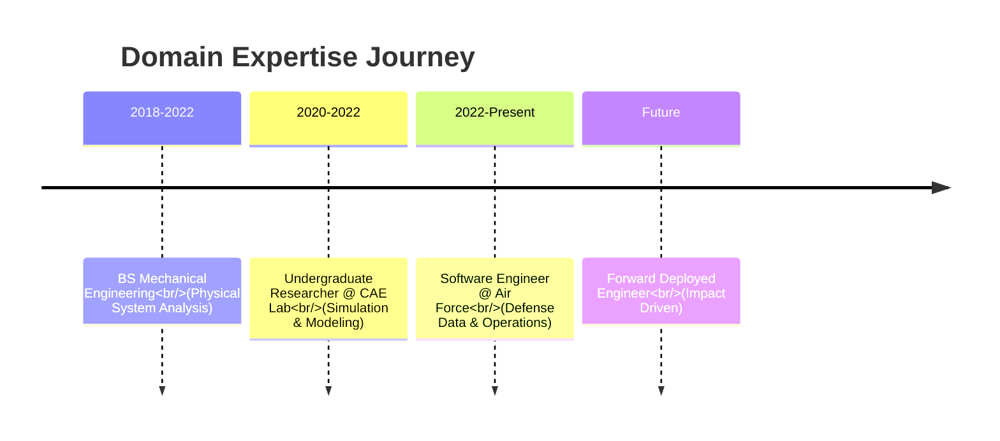

<div align="center">

# 👋 Hi, I'm Luke (Hyungjin Lee)

### Defense Tech Specialist | Data Engineer | Mechanical Background

[](https://lukedev.info)
[](https://www.linkedin.com/in/%ED%98%95%EC%A7%84-%EC%9D%B4-ab1a29247/)
[](mailto:luke93052080@gmail.com)
[](https://informluke.tistory.com/)

</div>

---

## 🚀 About Me

> **"Bridging the gap between Physical Operations and Digital Intelligence."**

I am a **Forward-Thinking Engineer** combining a strong foundation in **Mechanical Engineering** with modern **Data Science & Software capabilities**.

Currently serving in the **ROK Air Force**, I specialize in solving complex physical problems using digital tools. Unlike typical developers, I understand the **"physics"** behind the data—whether it's aircraft maintenance logs, sensor vibrations, or supply chain logistics. I build systems that don't just look good, but **work in the field.**

```typescript
const luke = {
  role: "Software Engineer @ ROK Air Force",
  domain: ["Defense Tech", "Mechanical Engineering", "Data Analytics"],
  
  currentFocus: [
    "Project IronClad (Sortie Gen. Rate Prediction)",
    "Parametric Design Automation (Fusion 360 API)",
    "Palantir Foundry & Ontology"
  ],

  // Yes, I can also build full-stack apps to visualize this data!
  auxiliarySkills: ["Next.js", "System Design", "DevOps"] 
};

```

---

## 💼 Professional Experience



---

## 🛠️ Tech Stack

### 🧠 Data Engineering & AI (Primary)

### ⚙️ Domain Engineering & Simulation

### 📊 Visualization & Interfaces (Secondary)

> I leverage web technologies to build dashboards and deliver insights to end-users.

---

## 🎯 Impact & Projects

<table>
<tr>
<td width="50%">

### 🛡️ [Project IronClad (WIP)](https://www.google.com/search?q=)

**Defense Resource Optimization**

* **Goal:** Predict aircraft sortie generation rates based on supply chain variables.
* **Tech:** Synthetic Data Gen, Random Forest, Python.
* **Impact:** Simulating resource bottlenecks in wartime scenarios using ML models.

`Python` `Data Analysis` `Defense Tech`

</td>
<td width="50%">

### 🤖 [Fusion 360 to ROS Automation](https://github.com/RO-AD/fusion2urdf_ros2cpp)

**Parametric Design Pipeline**

* **Goal:** Automate the conversion of CAD designs to Robot Simulation (URDF).
* **Impact:** Reduced modeling-to-sim time by 60% for robotics researchers.
* 🎤 Presented at **Autodesk Webinar**.

`Fusion 360 API` `Python` `Automation`

</td>
</tr>

<tr>
<td width="50%">

### 🧠 Robotic Arm Fault Diagnosis

**Predictive Maintenance Model**

* **Goal:** Detect mechanical failures using vibration sensor data.
* **Method:** Deep Learning (CNN) applied to time-series sensor data.
* 🏆 **Grand Prize** - Capstone Design.

`TensorFlow` `Signal Processing` `Predictive Maint.`

</td>
<td width="50%">

### 🛡️ Defense Robotics Platform

**Unmanned Ground Vehicle (UGV)**

* **Role:** Lead Engineer for Mechanical Design & ROS Integration.
* **Tech:** Full CAD design, Sensor integration, Autonomous navigation.
* 🏆 National Defense Robotics Competition Finalist.

`ROS` `Gazebo` `Mechatronics`

</td>
</tr>
</table>

---

## 📊 GitHub Stats

<div align="center">


</div>

---

## 🏆 Certifications & Awards

* **TensorFlow Developer Certificate** (Google) - *Data Capability*
* **Grand Prize, Capstone Design Competition** - *Engineering Excellence*
* **Autodesk Webinar Speaker** - *Fusion 360 API Expert*
* **Engineer Information Processing** - *CS Fundamentals*

---

## 📫 Let's Connect!

I am always open to discussing **Defense Tech, Palantir Foundry, and Parametric Design**.

<div align="center">

</div>

<div align="center">

### "Transforming Data into Physical Reality"

</div>
