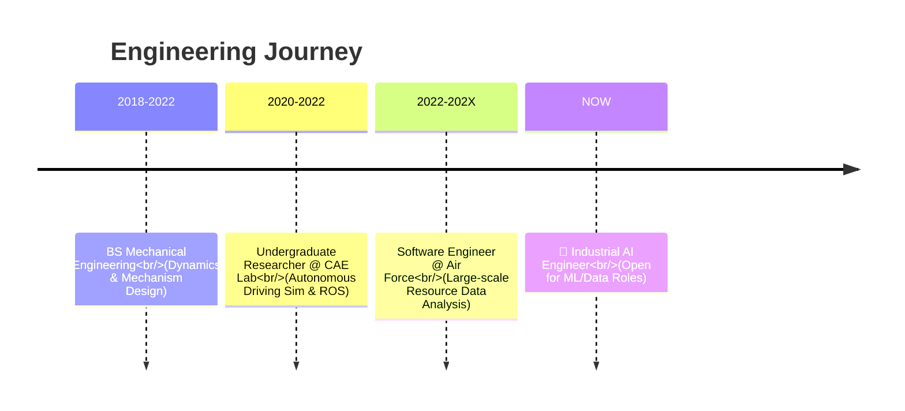

<div align="center">

# 👋 Hi, I'm Luke (Hyungjin Lee)

### Industrial AI Engineer | Mechanical & ML Specialist
#### *Data-Driven Engineering for Physical Systems*

[](https://lukedev.info)
[](https://www.linkedin.com/in/%ED%98%95%EC%A7%84-%EC%9D%B4-ab1a29247/)
[](mailto:luke93052080@gmail.com)
[](https://informluke.tistory.com/)

</div>

---

## 🚀 About Me

> **"Combining mechanical intuition with AI data analytics."**

I am an **Industrial AI Engineer** who understands **Mechanical Systems** and optimizes them using **Data & AI technologies**.

With a strong foundation in Mechanical Engineering, I deeply understand hardware principles. Through my service as a Software Engineer in the Air Force and my academic research, I have honed the skills to digitize physical systems. Beyond simple coding, I focus on solving critical industrial challenges such as **Predictive Maintenance, Process Optimization, and Design Automation** using Machine Learning.

My goal is to translate "physical problems" from the field into "data language" to create tangible value.

```typescript
const luke = {
  name: "Hyungjin Lee (Luke)",
  role: "Machine Learning Engineer (Manufacturing/Robotics)",
  
  // ✅ Core Values: Convergence of Mechanics & AI
  coreValues: ["Physical AI", "Data-Driven Engineering", "Digital Twin"],
  
  background: {
    major: "Mechanical Engineering",
    experience: "Software Engineer (Ex-ROK Air Force)"
  },
  

  // Capable of Full-Stack Development for Visualization
  techStack: ["Python", "TensorFlow", "Fusion 360", "Next.js"] 
};

```

---

## 💼 Timeline



---

## 🛠️ Tech Stack

### 🧠 Industrial AI & Data Analysis (Primary)

> *Extracting insights from data.*

### ⚙️ Engineering & Simulation

> *Building digital twins and engineering environments.*

### 📊 Visualization & Dashboard

> *Visualizing engineering data on the web.*

---

## 🎯 Featured Projects

<table>
<tr>
<td width="50%">

### 🤖 [Fusion 360 URDF Generation](https://github.com/RO-AD/fusion2urdf_ros2cpp)
**Robot Simulation Tool**

- 🎤 Presented at **Autodesk Webinar**
- 🔧 Fusion 360 API integration
- 🎮 Unity & NVIDIA Omniverse compatible
- 📹 [Watch Demo](https://www.youtube.com/watch?v=n4WcBF8ReGQ)

`Fusion360` `Python` `Unity` `URDF` `ROS`

</td>
<td width="50%">

### 🛡️ Defense Robotics Competition
**Robotic Arm & Vehicle Development**

- 🏆 National Defense Robotics Competition
- 🔩 Full mechanical design in Fusion360
- 🤖 ROS & Gazebo simulation
- 👥 Founded & led club **RO:AD**

`ROS` `Gazebo` `URDF` `Python`

</td>
</tr>

<tr>
<td width="50%">

### 🧠 Robotic Arm Fault Diagnosis
**ML-Based Fault Detection**

- 🏆 **Grand Prize** - Capstone Design
- 📊 Deep Learning for diagnostics
- 🎓 Graduation Thesis Project
- 🔬 Mechanical + AI integration

`TensorFlow` `Machine Learning` `Python`

</td>
<td width="50%">

### 🚗 Unity ML Autonomous Driving
**Inter-City Self-Driving Simulation**

- 🎮 Unity ML-Agent environment
- 🚙 Autonomous vehicle simulation
- 📄 Conference paper (2nd author)
- 🏅 Advanced to finals

`Unity` `ML-Agent` `Deep Learning`

</td>
</tr>
</table>

---

## 🏆 Achievements

* **TensorFlow Developer Certificate** (Google) - *Deep Learning Capability*
* **Autodesk Fusion 360 Webinar Speaker** - *CAD API Expertise*
* **Grand Prize, Capstone Design Competition** - *Engineering Excellence*
* **Engineer Information Processing** - *CS Fundamentals*

---

## 📫 Let's Connect!

I am actively looking for opportunities as a **Machine Learning / Data Engineer** with a focus on Mechanical Domains.
I am always open to discussing **Smart Factory, Robotics AI, and Engineering Data Analysis**.

<div align="center">

</div>

<div align="center">

### "Engineering the Physical World with Digital Intelligence"

</div>
